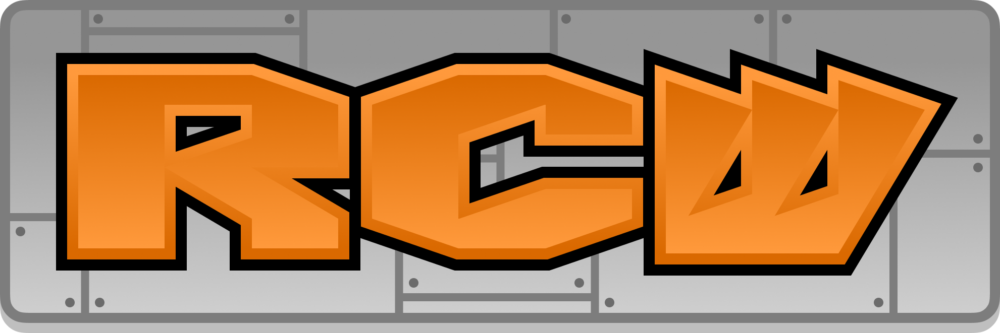

    

## random color words...

*play the game in your browser on [itch](https://aczw.itch.io/rcw)! there are also Windows, Linux, and macOS builds under [releases](https://github.com/aczw/RCW/releases/)*

based on the [Stroop effect](https://en.wikipedia.org/wiki/Stroop_effect) and *heavily* inspired by [OLDTV](https://store.steampowered.com/app/643270/OLDTV/). this is my first time with Unity and gamedev in general so expect many. bugs

## instructions

every round. a color word will be displayed in a random color. use left and right arrow keys to decide if it's correct or not. tap the right arrow key if the color matches the word, and the left arrow key if they don't match.

sometimes, the round is reversed. in that case, tap the left arrow key if the color matches the word, and the right key for the opposite.

that's it. that's the whole game. oh, and the faster you answer each round, the more points you will get. there's no ending, but rounds are three seconds.

if you don't answer in time or get the word wrong, you lose points and a life. you only have three lives, so watch out.

## credits

I did the programming and visuals, but I'm terrified of pianos. thanks to Eric Matyas (via [Sound Image](https://soundimage.org/)) for the music, and SubspaceAudio (via [OpenGameArt](https://opengameart.org/content/512-sound-effects-8-bit-style)) for the sound effects.

## yeah

thanks for playing and please leave feedback! this has been fun.
